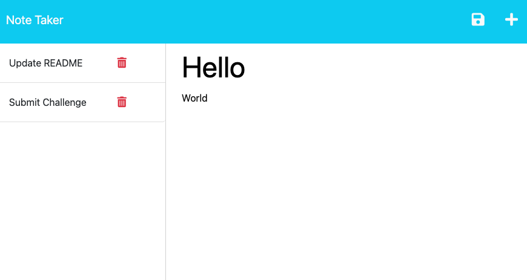

# Challenge 11 - Note Taker

## Project Description

Track your most important notes and tasks everywhere you go from any browser, no installation needed! Keep your notes up to date by deleting the ones you no longer need. You may also integrate other apps with this web app by leveraging the easy to use built-in API.

The backend for this app is written in Express.js and deployed to Heroku. It supports GET, POST, and DELETE HTTP methods that are used by front-end functionality. The Heroku deployment was completed via Heroku CLI following their [Node.js documentation](https://devcenter.heroku.com/articles/getting-started-with-nodejs).

Even though I have integrated with countless APIs in my career, this is the first time I have developed a Web API on my own. With the knowledge I have gained, I know I can expand the functionality of personal projects I am working on.

## Table of Contents
- [Credits](#credits)
- [User Story](#user-story)
- [Acceptance Criteria](#acceptance-criteria)
- [Links](#links)
- [Dependencies](#dependencies)
- [Usage](#usage)
- [Screenshots](#screenshots)

## Credits

The `fsUtils.js` file in the `helpers` directory was taken from the bootcamp mini project exercise we completed during class at the end of week 11. I modified the code slightly to fit my solution.

## User Story

```
AS A small business owner
I WANT to be able to write and save notes
SO THAT I can organize my thoughts and keep track of tasks I need to complete
```

## Acceptance Criteria

```
GIVEN a note-taking application
WHEN I open the Note Taker
THEN I am presented with a landing page with a link to a notes page
WHEN I click on the link to the notes page
THEN I am presented with a page with existing notes listed in the left-hand column, plus empty fields to enter a new note title and the note’s text in the right-hand column
WHEN I enter a new note title and the note’s text
THEN a Save icon appears in the navigation at the top of the page
WHEN I click on the Save icon
THEN the new note I have entered is saved and appears in the left-hand column with the other existing notes
WHEN I click on an existing note in the list in the left-hand column
THEN that note appears in the right-hand column
WHEN I click on the Write icon in the navigation at the top of the page
THEN I am presented with empty fields to enter a new note title and the note’s text in the right-hand column
```
 
## Links

To access the code repository and live website, use the links below:

- ### GitHub Repository URL
    https://github.com/sergiorodriguezdev/chl-11-note-taker 
- ### Heroku App URL
    https://chl-11-note-taker.herokuapp.com/

## Dependencies

To install the appropriate dependencies, execute the following command from the repo folder:

```
npm install
```

Alternatively, if the `package.json` file is missing, execute the following commands from the repo folder:

```
npm init -y
npm install express@4.16.4
```

## Usage

Clone or download the repo folder to your local machine and install the dependencies as specified in the [Dependencies](#dependencies) section. Then, launch the app using the following command:

```
node server.js
```

To access the app, open a web browser and go to the URL specified in the terminal window - the default will likely be `http://localhost:3001`.

You can also deploy the app to your Cloud provider of choice following their documentation.

## Screenshots

### Web App





### API


